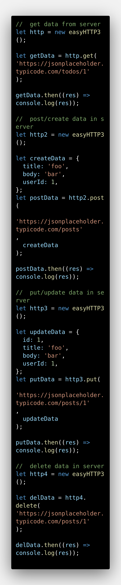

# easyHTTP

easyHTTP is a very simple & easy to use javascript module to handle HTTP request.

## Functions:

- You can use this utility to handle basic REST api requests very easily.
- There are 4 methods-get,post,put & delete to do all kind of request handelling in javascript.

## How to use easyHTTP:

There are 3 versions of easyHTTp-

1.easyHTTP

2.easyHTTP2

3.easyHTTP3

Here is a example of using easyHTTP4 module-

## Developer:

### Name: Sonet Adhikary

### Email: sonet.ad101@gmail.com
